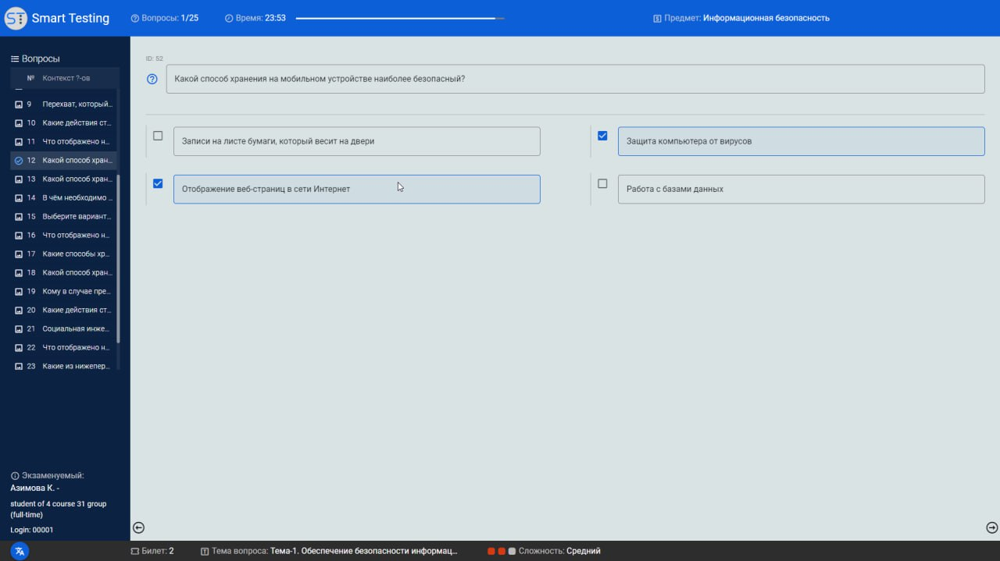

# st-exam-client

### Стек технологий
<div>
    
    
    
    
</div>

###
> Проект провальный. Рабочий, но очень плохо написанный. <strong>Идёт работа над над ST v.1.2</strong>

### Информация
<strong>st-exam-client</strong> - один из модулей системы SmartTesting. Представляет собой десктоп клиент, на котором экзаменуемые решают тесты.

<div align="center">
    
    
    
    
</div>

######
Перед входов в экзамен, если тесты написаны на нескольких языках, то экзаменуемому предлогается выбрать один из предложенных языков.

Во время экзамена, каждое действие экзаменуемого (пропуск вопроса, ответ на вопрос) фиксируется в IndexedDB и отправляется на [st-helper-server](https://github.com/rakhmight/st-exam-client).

Если клиент выкинет ошибку при исполнении кода, то ошибка будет отображена на экран и сохранена в IndexedDB.

### Сборка и запуск
- устанавливаем зависимости:
```bash
npm i
```

- собираем десктопную версию клиента:
```bash
npm run electron:build
```
###
> После завершения сборки установочный файл будет находиться в директории /dist_electron/bundled